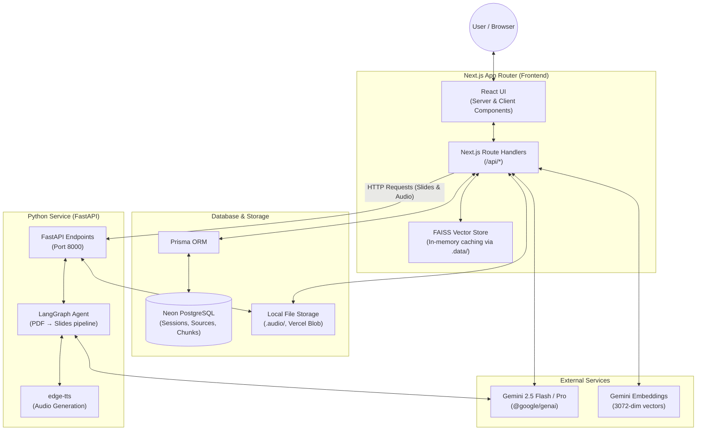

# Narrativa — AI-Powered Research Notebook

[](https://youtu.be/v3lkLRfNYYA)

Narrativa is a full-stack web application that acts as your personalized AI research assistant (inspired by Google NotebookLM). Upload documents, paste web links, or add YouTube videos as sources — then let the AI generate audio podcasts, executive summaries, presentation slides, and deep-dive research reports from your knowledge base.


---

## ✨ Features

- **3-Panel Workspace:** Animated landing page + dedicated research notebook with sources panel, chat, and studio tools.
- **Source Management:** Upload PDFs, paste YouTube URLs, or link to web pages to build a per-session knowledge base.
- **Chat with Citations:** Ask questions against your sources; the AI responds with precise, inline citations (e.g., `[Source-1]`).
- **5 Studio Tools:**
  | Tool | Description |
  |------|-------------|
  | 🎧 Audio Overview | Generates a conversational podcast explaining your sources via TTS. |
  | 📊 Executive Summary | Creates a structured one-page overview with key findings. |
  | 🎨 Slides Generator | Converts PDFs into beautiful Reveal.js presentation slides using a LangGraph workflow. |
  | 📽️ Topic to Slides | Researches any web topic and creates data-driven presentations. |
  | 📚 Research Report | Writes a comprehensive academic report with references. |

---

## 🏗️ Architecture

The system is distributed across a Next.js frontend application and a Python FastAPI backend, integrated with a PostgreSQL database and Google's Gemini LLMs.



---

## ⚙️ Technical Overview

Narrativa leverages a sophisticated architecture combining modern web frameworks, LLM integrations, and Retrieval-Augmented Generation (RAG).

### 1. Retrieval-Augmented Generation (RAG) Pipeline
- **Ingestion & Chunking:** Uploaded documents (PDFs, Web Pages, YouTube Transcripts) are parsed and divided into semantically meaningful chunks.
- **Embeddings:** Each chunk is converted into a 3072-dimensional embedding using Google's Gemini Embedding API.
- **Vector Search (FAISS):** A pure-JS implementation of FAISS runs in-memory. Embeddings are cached to a local `.data/` directory for fast consecutive retrievals. On cold starts in serverless environments, the vector index is dynamically rebuilt from chunks stored persistently in PostgreSQL.
- **Synthesis:** For chat and tool compilation, retrieved chunks are injected as context to Gemini 2.5 models to generate grounded responses, with strong system prompts enforcing strict citation formatting.

### 2. Multi-Agent Python Backend (LangGraph)
Complex document processing is offloaded to a standalone Python backend to bypass serverless execution time limits and leverage native Python data science libraries:
- **Slide Generation Workflow:** A state-graph approach via **LangGraph**. The system utilizes iterative planning: an agent parses PDF content using `PyMuPDF`, formulates an outline, generates specific slide content (injecting relevant charts and data), and compiles the output into a Reveal.js bundle.
- **Audio Generation:** Text-to-Speech synthesis is achieved using `edge-tts`. The generated audio artifacts are served statically or pushed to blob storage.

### 3. Data Persistence Layer
- **SQL Database:** Uses **Prisma ORM** over a **Neon PostgreSQL** database. The schema cleanly separates `Session` (a workspace instance), `Source` (raw documents/links), `DocumentChunk` (text pieces for vector search), and `Artifact` (generated outputs like slides, audios, and reports).
- **File Storage:** Locally, the application saves artifacts to `.audio/` and `.data/`. In a production deployment, this maps to Vercel Blob or similar remote object storage.

---

## 🚀 Local Development Setup

### Prerequisites

- **Node.js** v18+ and npm
- **Python** 3.10+
- A [Google Gemini API key](https://aistudio.google.com/apikey)
- A PostgreSQL database ([Neon](https://neon.tech) free tier recommended)

### 1. Clone & Install

```bash
git clone <repository-url>
cd Neurals

# Install Node.js dependencies
npm install
```

### 2. Configure Environment

```bash
cp .env.example .env
```

Edit `.env` and fill in your values:

| Variable | Required | Description |
|----------|----------|-------------|
| `GEMINI_API_KEY` | ✅ | Google Gemini API key |
| `GOOGLE_API_KEY` | ✅ | Same Gemini key (used by `@google/genai`) |
| `DATABASE_URL` | ✅ | PostgreSQL connection string |
| `PYTHON_API_URL` | ❌ | Python backend URL (defaults to `http://localhost:8000`) |
| `BLOB_READ_WRITE_TOKEN` | ❌ | Vercel Blob token (production only) |

### 3. Initialize Database

```bash
npx prisma db push
```

### 4. Start the Python Backend

```bash
cd python_backend

# Create and activate virtual environment
python -m venv .venv

# Windows:
.venv\Scripts\activate
# macOS/Linux:
# source .venv/bin/activate

# Install dependencies
pip install -r requirements.txt

# Start the FastAPI server
uvicorn app:app --host 0.0.0.0 --port 8000 --reload
```

### 5. Start the Next.js Dev Server

```bash
# From the repo root
npm run dev
```

Open [http://localhost:3000](http://localhost:3000) 🎉

---

## 📁 Folder Structure

```text
Neurals/
├── src/
│   ├── app/                    # Next.js App Router
│   │   ├── page.tsx            # Animated landing page
│   │   ├── notebook/[id]/      # 3-panel research workspace
│   │   ├── deck/[id]/          # Reveal.js slide viewer
│   │   └── api/                # Route Handlers (chat, upload, generate-*)
│   └── lib/                    # Shared utilities
│       ├── db.ts               # Prisma client singleton
│       ├── store.ts            # Session, source, chunk CRUD operations
│       ├── vector-store.ts     # FAISS index management
│       ├── embeddings.ts       # Gemini embedding helpers
│       ├── retrieval.ts        # RAG retrieval pipeline
│       ├── web-search.ts       # Web scraping for Topic-to-Slides
│       └── generate-text-slides.ts  # Text-based slide generation
├── prisma/
│   └── schema.prisma           # Database schema (Session, Source, Chunk, Artifact, Report)
├── python_backend/             # Standalone FastAPI service
│   ├── app.py                  # FastAPI endpoints (slides, audio)
│   ├── agent.py                # LangGraph React agent (PDF → Slides)
│   ├── tools.py                # Agent tools (analyze PDF, plan slides, etc.)
│   ├── config.py               # Gemini model configuration
│   ├── tts.py                  # edge-tts wrapper
│   ├── requirements.txt        # Python dependencies
│   └── Procfile                # Render/Railway start command
├── scripts/
│   └── youtube_transcript.py   # YouTube transcript fetcher
├── .env.example                # Environment variable template
├── package.json                # Node.js dependencies & scripts
├── next.config.ts              # Next.js config
├── prisma.config.ts            # Prisma datasource config
└── tsconfig.json               # TypeScript config
```

---

## 🤝 Contributing

Contributions and feature requests are welcome! Create a branch and submit a PR for review.

## 📄 License

This project is proprietary. All rights reserved.
